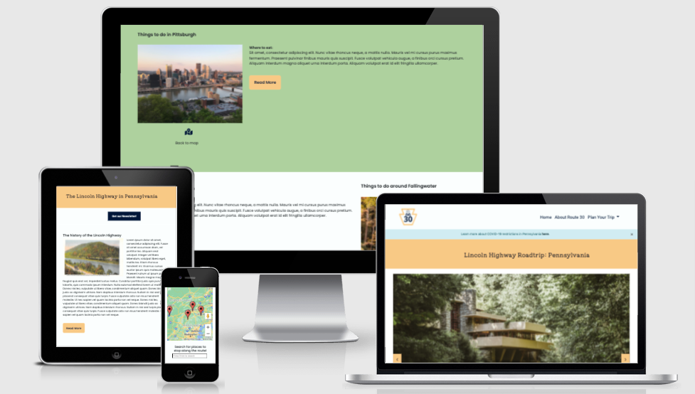
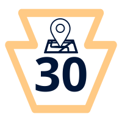
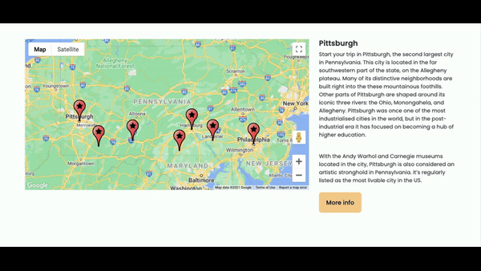
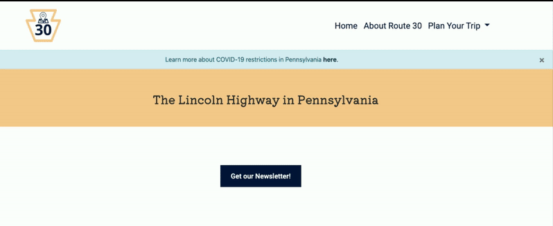
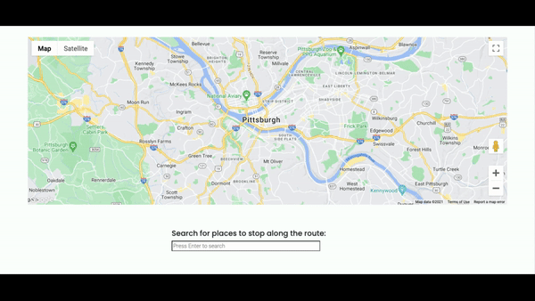

# Lincoln Highway Road Trip: Milestone 2

## About this project

The aim of this project is to help people plan a road trip along the Lincoln Highway in Pennsylvania. 

1.	Give people the option to plan a trip that doesn’t require much air travel or public transportation, in line with COVID-19 restrictions. 
2.	Highlight the benefits of an old highway road trip like quirky roadside attractions and locally owned restaurants/hotels. I planned this trip based on a road trip I took back in 2016, so that I could really get to know the most eclectic parts of my home state (the heart of my state) before I moved to Ireland. The core of this project is based on that specific trip. 
3.	Educate road trippers on the history of the Lincoln Highway, which is one of the oldest cross country highways in the US. It’s now mostly bypassed by the turnpike on route 76 in Pennsylvania. One aim of this project is to encourage holiday-makers to stay off the beaten path and explore recent history based off of one road. 

The Lincoln Highway Road trip is a project meant to give people an alternate to public trave during a pandemic, persuade travelers to explore attractions off the beaten track, and teach site visitors about the history of the Lincoln Highway/the state of Pennsylvania along the way. 

## Live Site

www.lincolnhighwayroadtrip.com

From [Am I Responsive?](http://ami.responsivedesign.is/)

## Table of Conents

 

## UX Planning

### Research:

I started this project by researching travel sites that are specifically for planning out a road trip. The purpose of this research was to narrow down specific features that would work best for a road trip instead of destination travel. 

I'm going to cite some of these sites here:

[Roadtrippers](https://roadtrippers.com/)

[The Atlas Obscura Guide to Pennsylvania](https://www.atlasobscura.com/things-to-do/pennsylvania)

[The Irish Road Trip](https://www.theirishroadtrip.com/)

[Lincoln Highway Heritage Corridor](https://lhhc.org/welcome.html)

### User Stories

User stories are effective for planning out and determing which features will work on the site and which features will cause scope creep. As I worked on this project, I was able to identify which user stories would help me build an effective travel site in the time period for this project, and which features needed to be changed or pushed back to a later version of the site. 

These are the user stories I've identified for the current version of this project:

1.	Jo wants to have a slideshow of the unique attractions along the highway, so that they can talk their partner into taking a road trip instead of going on a beach holiday.
2.	Julia likes to plan ahead for places to eat and other places of interest in while she’s on a road trip. She wants to find suggestions for restaurants and hotels directly on the site.
3.	Miles is fascinated by the history of the roadside attractions on the Lincoln highway. He wants to learn more about the general history of the highway and facts about the attractions. 
4.	Skye lives near the Lincoln highway heritage quarter in Pennsylvania and wants to keep up with events at each destination. She’d like to subscribe to a newsletter to get updates. 
5.	Robert wants to have a way to search the map for places to stop along the way. He’s particularly concerned with locating petrol stations, so that the car doesn’t break down and so that he can keep an eye on the cost of petrol. 

### Wireframes

### Design

**Colors**

To plan the colours for this site, I ran the Pennslyvania flag through [Coolors](https://coolors.co/).

Then I used Coolors to desaturate the heavy, government-issued colours of the Pennsylvania state flag into a softer and more modern palette.

Here's the original palette I started with: 

[Pennsylvania state flag colours](https://coolors.co/022986-ffb800-c3ddb7-b25b00-858fa8)

I'm also attaching a link to the state flag for reference:

[Flag of Pennsylvania](https://www.britannica.com/topic/flag-of-Pennsylvania)

And here's my completed, softer pallette that was used on the site styles:

[Lincoln Highway Road Trip colour palette](https://coolors.co/ffca85-011638-087e8b-aed19e-dce5e2)

The whole site mostly has a background colour of very light blue-grey. To add some contrast between the header and the rest of the site, I put banners of light green or yellow at the top of the page as a banner. I also added altnernating sections of green and light blue on the maps page so that each location section stood out from the one above it on the page. 

The background colours on the site are all light, and I made all text on the site dark to contrast. This makes it easier for site visitors to read the text. Any text area that was difficult to read, I updated to improve my accessibility score on Lighthouse. 

**Logo Design**

The logo colours are the yellow and dark blue used in other areas of the site. 

The logo shape is the keystone, which is an emblem for the state of Pennsylvania (the keystone state). I chose the keystone instead of the generic route symbol used in the US to distinguish the scope of this project. The route sign is used throughout the US, but the keystone is specific to Pennsylvania. 

Inside the keystone, I placed 30 for the name of the route that's assigned to the Lincoln Highway. All routes in the US have a number assigned to them, but only some have specific names like the Lincoln Highway. I also added a map symbol to represent that this website is meant for planning a road trip. 

For the logo, I avoided using the colours or emblems used by the official Lincoln Highway Heritage Corridor or Historical organisations. I did this to avoid copyright infringement, as I'm not associated with these organisations. 

**Fonts**

I used Google fonts for this project, and chose fonts that are currently popular on the Google fonts front site: Roboto, Poppins, and Kiwi Maru. 

Roboto is an easy to read and accessible font that pairs well with nearly any font. I used Roboto in my header and footer navigation link areas. 

I chose Poppins for the main text areas of my site because it's the default font used on some website building platforms. It's clear, accessible, and resizes well on mobile devices without needing to be adjusted. Also, I prefer sans serif fonts, so from a design perpective prefer to use them in my design planning. 

In the banner headings near the top of each page, I used Kiwi Maru because it's both bold and quirky. I think it complements the san serif fonts used on the rest of the site, while adding a fun touch to the main headings. 

The reason I used three fonts is that I understand a font pack should remain small and that adding multiple fonts to a site can increase loading time.

## Features:

### User Story Features:

#### User story 1- Image slideshow
The slideshow feature is meant to draw the site visitor in so that they can see for themselves the unique roadside attractions on the Lincoln Highway. These quirky attractions, like the Fallingwater House or the Bedford Coffee Pot restaurant are certainly unique and not features that you would find anywhere else in the world. They’re talking points. 

I imagined a person who wants to convince their partner to plan a road trip instead of going to the beach for a few days. I thought, would I be convinced by compelling images to take a holiday that jumps from one place to the next instead of a relaxing one? 

The slideshow is meant to convince people who are on the fence. It’s like a thesis statement of: ‘what do you think about this?’ Then the site visitor can click through each image and decide for themselves. 

To build the slideshow, I followed the instructions from this W3 schools [guide](https://www.w3schools.com/howto/howto_js_slideshow.asp).

I edited their HTML to add in stock images specific to different locations along the way, which I’ve sited the sources for below. The captions and numbers on the demo slideshow were also removed from the code on the live site. 

The images are not in the exact order of the trip, but in a random order. The reason for this choice is that the Fallingwater image works the best with the site’s colour scheme and is an elegant introduction to what the road trip guide has to offer. Plus, one image location may stick out to a different site visitor, so I wanted to have the images appear at random so that they would have to go to the map page to learn more. 

The CSS for the slideshow demo was edited to match the colour scheme for the site. 

For the most part, the JavaScript from the tutorial was followed closely with little change. I’ve marked this in the JavaScript file the slideshow, along with my own notes.

#### User Story 2- Information about hotels/restaurants 

This feature is connected to the main Google Map that’s on the map page. 

To allow users to navigate the map page to plan out their road trip, I added a few buttons on the page. The first is on the card for each map location, that appears when you click on a map pin. There’s a More Info anchor link that then takes the user to a location section on the page.

In each location section, I added in a paragraph of text with external links to different places to eat along the road trip. Then I created a Read More button with jQuery to show more information about hotels and places of interest (more external links). The jQuery button also can be clicked on to show less information (Read Less). jQuery was specifically used to demonstrate that I understand how to use this JavaScript framework.

I followed these two Youtube videos for instructions on how to build these Read More/Read Less buttons with jQuery:

[LearnDesign]( https://www.youtube.com/watch?v=uI18xGocVnw)

[Coding Artist](https://www.youtube.com/watch?v=uzSkExQtPkg)

Finally, I added an anchor link to a map icon below the image in each location section. The map icon anchor link jumps back to the Google Map near the top of the page.

I used `scroll-behavior: smooth;` CSS to make all these page jumps less harsh.

#### User Story 4- Newsletter 

I initially wanted to create a pop-up newsletter subscribe feature that appears when you enter the site. 

To test out this feature, I tried adding embed code from Mailchimp to the homepage, but I didn’t think that this pop-out feature was intuitive for this project. While automatic pop-ups can be built with JavaScript, I didn’t think that this feature was good for user experience. The user is reminded to sign up for the newsletter, but they don’t have a choice over whether they see this pop-up or not. 

I decided to go for a design similar to the Contact Us button that I added in the site footer instead. The contact button gives the site visitor a choice if they want to access the newsletter form. 

I placed the newsletter sign up buttons on the map page and on the about page, near the top of the page to remind visitors to sign up. 

To build the pop-out button and modal, I used a link styled like a button following the instructions from CSS tricks [here](https://css-tricks.com/css-basics-styling-links-like-boss/).

Then I followed [these instructions](https://www.w3schools.com/howto/howto_css_modals.asp) from W3 Schools to build a pop-out modal. 

The modal HTML is a basic form with a Bootstrap button. It’s the same type of form used in my Contact Us button (which is based on a form I created for my Milestone 1 project). I added an image to this newsletter pop-out content to add more space and emulate the style of the Mailchimp test form I made. 

For form storage, I used EmailJS. I followed [their documentation](https://www.emailjs.com/docs/tutorial/creating-contact-form/) directly. I couldn’t get the instructions from the course video to work as expected, and I’ve noted this in my testing section.

My mentor suggested that I try using a custom post-submit pop-out for after the form is sent, instead of a general alert. So I added these feature to the form using Sweet Alert’s documentation [here](https://sweetalert.js.org/).

To reset the form after information has been sent to EmailJS, I followed [these instructions](https://developer.mozilla.org/en-US/docs/Web/API/HTMLFormElement/reset) from Mozilla’s documentation.

#### User Story 5- Search Box for Map

I added a Google Places Search Box so that users can search for petrol stations or other locations to stop not mentioned on the location setions. This feature was originally part of the map on the Plan Your Trip page. However, I have the map on this page set to a zoom of 7 to show all the markers and cards for designated places of interest.

After testing on the Search Box and trying to set specific bonds for the map, it turned out that the Search Box local markers don't stay fixed on the viewport if you have a closer zoom in on the map. I've more information on this in the testing section. 

My mentor and I decided that the best way to add this feature in would be to create a new map and Search Box on a page titled Search. The map is zoomed out to a 13 zoom on Pittsburgh, so that site visitors can move around the map and use the Search Box to find specific points of interest around each location on their own. 

The JavaScript for this feature is mostly from [Google Search Box's documentation](https://developers.google.com/maps/documentation/javascript/examples/places-searchbox#maps_places_searchbox-javascript).

I also followed the instructions on the general [Google Autocomplete documentation](https://developers.google.com/maps/documentation/javascript/places-autocomplete?hl=en#places-searchbox).

### Other Existing Features

#### Bootstrap Nav

To save time to build other features on the site, I used a Bootstrap navigation with a dropdown folder for anchor links on the Plan Your Trip (map) page. 

I followed the navbar instructions on Bootstrap [here](https://getbootstrap.com/docs/4.0/components/navbar/#nav).

The instructions for building the mobile navigation on Bootstrap were found [here](https://getbootstrap.com/docs/4.0/components/navbar/#responsive-behaviors).

#### Explore button

This feature is simply a link styles ad a button that links through to the Map it Out section of the map page. I placed this on the homepage so that a site visitor can click through to start planning their trip after seeing the slideshow.

#### Contact Us button

To save space on building a Contact Us page, I created a pop-out button that opens into a form. The form connects to EmailJS, requires Google reCAPTCHA to submit, and shows a Sweet Alert post submit message. 

This feature uses the same tools as the Newsletter feature for the User Story above. 

#### Social Links

I used Font Awesome icons to create external links to the homepage of social media sites (which would be real social media pages for an actual business) and to my email and phone. 

Because these are external links that I'm not entirely sure are secure, so I used `rel="noopener"` tags on all external links used on the site. 

#### Explore Pennsylvania links

To give road trippers more options for researching/planning their trip, I included direct footer links to trave sites about distinctive and unusual locations in Pennsylvania. This was included to give visitors as much information to plan a completely unique trip that they have the resources to organise. 

#### Map with markers and corresponding cards

The map on the Map it Out page is the key feature for this project, since it marks out 7 locations in the state of Pennsylvania, going across the state from west to east. 

To start building this map, I followed the course instruction videos and [this guide](https://developers.google.com/maps/documentation/javascript/overview) on the Maps JavaScript API.

Then I added markers and info windows for each marker, which appear on mouseover/mouseout event listeners, by following this this [Youtube video](https://www.youtube.com/watch?v=Zxf1mnP5zcw) by Traversy Media.

I also followed [Google's documentation](https://developers.google.com/maps/documentation/javascript/infowindows) on adding info windows.

Next, I created custom map markers with a star inside the regular red Google maps marker. [This guide](https://developers.google.com/maps/documentation/javascript/custom-markers) taught me how to add the custom markers. The custom marker comes from [KML4 Earth](http://kml4earth.appspot.com/icons.html).

All maps on the site are styled to have an atlas design on Google's Cloud-based map styling, using [this documentation](https://developers.google.com/maps/documentation/javascript/styling).

Finally, I added custom location cards to the maps.js file. Each unique card appears when a site visitor clicks on the map marker. This part of the map feature was built using a click event listener and by following [this StackOverflow post](https://stackoverflow.com/questions/47017679/how-to-show-infowindow-content-in-separate-div).

## Technologies used

### Languages and libraries

- [HTML5](https://html.com/html5/)
    - This project uses **HTML5** to build the pages on the site.

- [CSS3](https://html.com/css/)
    - I used **CSS** to style the HTML.

- [Bootstrap CSS](https://getbootstrap.com/docs/3.4/css/)
    - I used **Bootstrap CSS** to style buttons on the site. I also used Bootstrap grids to create the structure of my pages and to allow the site to resize responsively on different devices.

- [Google Fonts](https://fonts.google.com/)
    - Roboto, Poppins, and Kiwi Maru were added to the project using **Google Fonts**

- [Font Awesome](https://fontawesome.com/)
    - I added icons from **Font Awesome** to the site footer and to encourage visitors to jump back up to the map section of the map page. 

- [JavaScript]( https://www.javascript.com/)
	- I used vanilla **JavaScript** for the slideshow, map, and form pop-outs on the site. 

- [jQuery](https://jquery.com/)
	- The Read More/Less button functionality works through **jQuery**.

- [Bootstrap JS](https://getbootstrap.com/docs/3.4/javascript/)
    - I used **Bootstrap JS** for the site navigation. I wanted to save time on adding a dropdown folder in the main navigation without having to code it myself. I also used Bootstrap JavaScript for the mobile navigation button. 

- [Popper](https://popper.js.org/) 
    - The navigation bar also uses **Popper**.

- Ajax
    - This was also used for the navigation bar.

- [Google Maps JS API](https://developers.google.com/maps/documentation/javascript/overview)
  - The map was created from this custom **Google Maps API** and the atlas style used for the map colouring comes from their built-in map style options and a unique map style ID. 

- [Google Places API](https://developers.google.com/maps/documentation/places/web-service/overview)
  - The Search Box feature connected to the map was added to the site using the **Google Places** library.

- [Google reCAPTCHA2](https://www.google.com/recaptcha/about/)
  - **reCAPTCHA2** is added to all forms through **EmailJS** to prevent form/newsletter spam. This only works on the live site, as the account is associated with my custom domain name.

- [EmailJS](https://www.emailjs.com/)
    - I used **EmailJS** for form storage on the contact form in the footer and for the newsletter sign up on the map and about pages.

- [Sweet Alert](https://sweetalert.js.org/)
  - This tool is used to show a post-submit alert after any form on the site is submitted to **EmailJS**.

### Other tools used

- [JIRA](https://www.atlassian.com/software/jira)
    - I built my original user stories and started the Strategy Plane on a **JIRA** board. 

- [Trello](https://trello.com)
    - I used a **Trello** scope/strategy board to visualise the development process/map out the Strategy and Scope Planes.    

- [Basalmiq](https://balsamiq.com/)
    - My wireframes were all built on Balsalmiq.

- [Free Logo Design](https://www.freelogodesign.org/)   
    - My logo was created on this tool.

- [GitPod](https://gitpod.io/)
    - I built the site on **GitPod**

- [GitHub](github.com/)
    - I stored and managed by code on **GitHub**
    - The site is deployed on **GitHub Pages**  
- [GoDaddy]( https://ie.godaddy.com/)
	- The site’s custom domain name: www.lincolnhighwayroadtrip.com is hosted by **GoDaddy**
- [GIMP](https://www.gimp.org/)
    - I edited images on this tool  

## Testing    

## Deployment

I used GitHub pages to deploy this project live online. This project was deployed early on so that I could ensure that the live content looks the same as it does on the GitPod preview. 

To do this I:

1. Logged into my GitHub account
2. Opened my repository for lincoln-highway-road-trip
3. Went to the Settings tab of my repository
4. In the Options tab of the Settings, went to the GitHub Pages section
5. Selected Master as the Source from a dropdown
6. Selected the /(root) folder
7. Clicked Save 

Then I connected my custom domain name by typing in my full domain name, including teh wwww subdomain and clicking Save. 

I added the custom DNS records from GitPod to the DNS panel on GoDaddy's end. [These steps](https://docs.github.com/en/pages/configuring-a-custom-domain-for-your-github-pages-site/managing-a-custom-domain-for-your-github-pages-site#configuring-an-apex-domain) from GitHub Pages' documentation walks you through how to connect the apex domain and the required DNS records.

Finally, I created a CNAME file in my respository to complete the connection and waited 24 hours for the SSL certificate to generate. 

This CNAME file created a conflict with my original workspace, which I wasn't able to pull through on GitPod. To fix this, I created a new GitPod workspace and was able to push new updates as expected. 

The live site can now be accessed live online at: wwww.lincolnhighwayroadtrip.com

## Credits

### Code sources

### Text content sources 

#### Location sections sources

**Pittsburgh**

https://www.visitpittsburgh.com/plan-your-trip/
https://en.wikipedia.org/wiki/Pittsburgh
https://theculturetrip.com/north-america/usa/pennsylvania/articles/where-to-eat-in-pittsburgh-pa-the-10-best-local-restaurants/

**Fallingwater**

https://en.wikipedia.org/wiki/Fallingwater
https://fallingwater.org/what-is-fallingwater/
https://www.golaurelhighlands.com/

**Bedford**

https://en.wikipedia.org/wiki/Bedford,_Pennsylvania
https://www.travelawaits.com/2496410/how-to-spend-a-weekend-in-bedford-pa/

**Gettysburg**

https://uncoveringpa.com/things-to-do-in-gettysburg-pa
https://destinationgettysburg.com/
https://www.nps.gov/gett/index.htm

**Harrisburg**

https://selectregistry.com/blog/things-to-do-in-harrisburg-pa/
https://www.visithersheyharrisburg.org/about/

**Lancaster**

https://fultonsteamboatinn.com/the-history-of-steamboats/
https://www.discoverlancaster.com/blog/10-reasons-to-visit-downtown-lancaster-pa/
https://www.discoverlancaster.com/blog/forbes-10-coolest-u-s-cities-to-visit/

**Philadelphia**

https://www.visitphilly.com/
https://en.wikipedia.org/wiki/Rocky_Steps 

### Images & media
